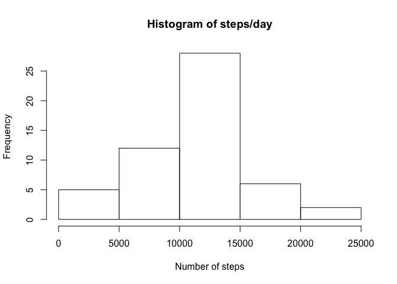
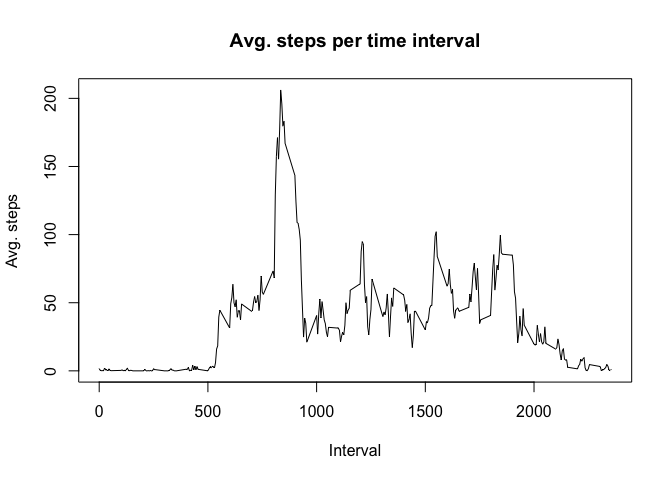

## Loading and preprocessing the data


```r
if(!file.exists('activity.csv')) {
  unzip('activity.zip')
}
activity <- read.csv('activity.csv')
```

## What is mean total number of steps taken per day?


```r
steps_per_date <- aggregate(steps ~ date, data=activity, sum, na.rm=TRUE)
```


```r
hist(steps_per_date$steps, 
     main = "Histogram of steps/day",
     xlab = "Number of steps")
```

<!-- -->


```r
mean_steps_daily <- mean(steps_per_date$steps)
median_steps_daily <- median(steps_per_date$steps)
print(paste("Mean steps per day: ", mean_steps_daily))
```

```
## [1] "Mean steps per day:  10766.1886792453"
```

```r
print(paste("Median steps per day: ", median_steps_daily))
```

```
## [1] "Median steps per day:  10765"
```

## What is the average daily activity pattern?


```r
activity_pattern_agg <- aggregate(steps ~ interval, 
                                  data = activity,
                                  mean,
                                  na.rm = TRUE)
plot(activity_pattern_agg$interval, 
     activity_pattern_agg$steps, 
     type='l',
     main='Avg. steps per time interval',
     xlab='Interval',
     ylab='Avg. steps')
```

<!-- -->


```r
max_rows <- activity_pattern_agg[which.max(activity_pattern_agg$steps),]
print(paste("Interval with maximum average steps: ", max_rows$interval))
```

```
## [1] "Interval with maximum average steps:  835"
```

## Imputing missing values


## Are there differences in activity patterns between weekdays and weekends?
